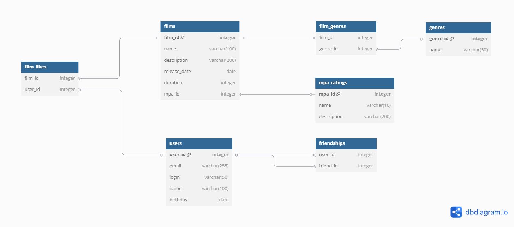

# java-filmorate
Template repository for Filmorate project.

# Filmorate Database Schema

## Описание схемы базы данных

- **users** - информация о пользователях
- **films** - данные о фильмах
- **mpa_ratings** - рейтинги
- **genres** - жанры фильмов
- **film_genres** - связь фильмов и жанров
- **film_likes** - лайки пользователей
- **friendships** - дружба
