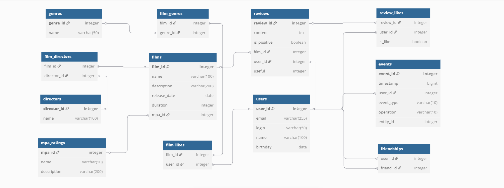

# java-filmorate
Template repository for Filmorate project.

# Filmorate Database Schema

## Описание схемы базы данных

Основные таблицы:
- **users** - информация о пользователях
- **films** - данные о фильмах
- **mpa_ratings** - рейтинги MPA
- **genres** - жанры фильмов
- **directors** - режиссеры фильмов

Связующие таблицы:
- **film_genres** - связь фильмов и жанров
- **film_likes** - лайки пользователей
- **friendships** - дружба
- **film_directors** - связь фильмов и режиссеров

Отзывы и лайки:
- **reviews** - отзывы пользователей на фильмы
- **review_likes** - реакции пользователей на отзывы (лайки/дизлайки)

Лента событий:
- **events** - история действий пользователей
